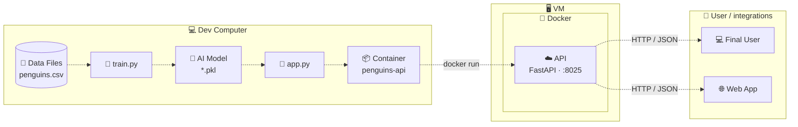

# 🐧 Penguins Classifier

Clasificador de especies de pingüinos (Palmer Archipelago) expuesto como API REST con **FastAPI**, empaquetado con **Docker** y desplegado en una **VM**. Tres modelos de scikit-learn entrenados y serializados; el cliente elige cuál usar en cada predicción.

> Repositorio: <https://github.com/aristotekean/penguins>

---

## Tabla de contenidos

- [Quick start](#quick-start)
- [Arquitectura](#arquitectura)
- [Flujo de datos y entrenamiento](#flujo-de-datos-y-entrenamiento)
- [Modelos](#modelos)
- [API de inferencia](#api-de-inferencia)
- [Entorno local con uv](#entorno-local-con-uv)
- [Docker](#docker)
- [Despliegue en VM](#despliegue-en-vm)
- [VPN y red](#vpn-y-red)
- [Control de versiones](#control-de-versiones)
- [Trazabilidad y reproducibilidad](#trazabilidad-y-reproducibilidad)
- [Estructura del proyecto](#estructura-del-proyecto)
- [Síntesis técnica](#síntesis-técnica)

---

## Quick start

```bash
# 1. Construir la imagen
docker build -t penguins-api .

# 2. Correr el contenedor
docker run -d --name penguins -p 8025:8025 penguins-api

# 3. Probar
curl -X POST http://localhost:8025/predict \
  -H "Content-Type: application/json" \
  -d '{"modelo":"randomforest","bill_length_mm":39.1,"bill_depth_mm":18.7,"flipper_length_mm":181,"body_mass_g":3750,"island":"Torgersen","sex":"MALE"}'
```

La API queda en <http://localhost:8025> y la documentación interactiva en <http://localhost:8025/docs>.

---

## Arquitectura

La arquitectura separa tres dominios: **desarrollo/entrenamiento**, **servicio** y **consumo**.



| Capa | Responsabilidad | Artefactos |
|------|-----------------|------------|
| Dev Computer | Preparar datos, entrenar, serializar modelos, construir la imagen | `train.py`, `*.pkl`, `app.py`, `Dockerfile` |
| VM | Ejecutar el contenedor y exponer el puerto `8025` | Imagen `penguins-api` |
| User / integrations | Consumir `POST /predict` | Cliente HTTP, Web App |

---

## Flujo de datos y entrenamiento

`train.py` procesa `penguins.csv` y genera los tres modelos.

| Paso | Detalle |
|------|---------|
| Limpieza | Se eliminan filas con datos incompletos |
| Features numéricas | `bill_length_mm`, `bill_depth_mm`, `flipper_length_mm`, `body_mass_g` |
| Features categóricas | `island`, `sex` → `OneHotEncoder` |
| Target | `species` |
| Split | 80/20 estratificado (mantiene la proporción de clases) |
| Evaluación | `accuracy` + `classification_report` |

```bash
uv run python train.py
```

---

## Modelos

Cada modelo es un `Pipeline` de preprocesamiento + clasificador, serializado con `joblib`.

| Modelo | Identificador en la API | Archivo |
|--------|-------------------------|---------|
| Random Forest (200 árboles) | `randomforest` | `model_randomforest.pkl` |
| Decision Tree | `decisiontree` | `model_decisiontree.pkl` |
| Logistic Regression | `logisticregression` | `model_logisticregression.pkl` |

> ⚠️ Los `.pkl` deben generarse con la **misma versión de scikit-learn** declarada en `pyproject.toml`. Un modelo serializado con otra versión puede fallar al cargarse en el contenedor. Si cambiás la dependencia, reentrená.

---

## API de inferencia

`app.py` carga los tres modelos al iniciar el servicio (`lifespan`) y expone un único endpoint.

### `POST /predict`

**Request**

| Campo | Tipo | Valores |
|-------|------|---------|
| `modelo` | string | `randomforest` \| `decisiontree` \| `logisticregression` |
| `bill_length_mm` | float > 0 | rango observado 32.1–59.6 |
| `bill_depth_mm` | float > 0 | rango observado 13.1–21.5 |
| `flipper_length_mm` | float > 0 | rango observado 172–231 |
| `body_mass_g` | float > 0 | rango observado 2700–6300 |
| `island` | string | `Torgersen` \| `Biscoe` \| `Dream` |
| `sex` | string | `MALE` \| `FEMALE` |

```json
{
  "modelo": "randomforest",
  "bill_length_mm": 39.1,
  "bill_depth_mm": 18.7,
  "flipper_length_mm": 181,
  "body_mass_g": 3750,
  "island": "Torgersen",
  "sex": "MALE"
}
```

**Response**

```json
{
  "species": "Adelie",
  "probabilities": {
    "Adelie": 0.98,
    "Chinstrap": 0.01,
    "Gentoo": 0.01
  }
}
```

| Ruta | Descripción |
|------|-------------|
| `/docs` | Swagger UI (documentación interactiva) |
| `/redoc` | ReDoc |
| `/openapi.json` | Esquema OpenAPI |

---

## Entorno local con uv

El proyecto usa [uv](https://docs.astral.sh/uv/) para gestionar y reproducir el entorno Python. Requiere **Python >= 3.12**. Las dependencias se declaran en `pyproject.toml` y se fijan en `uv.lock`.

### Instalar uv

```bash
curl -LsSf https://astral.sh/uv/install.sh | sh
```

### Instalar las dependencias

```bash
uv sync
```

### Correr el proyecto

```bash
uv run uvicorn app:app --reload
```

Por defecto Uvicorn escucha en `http://127.0.0.1:8000`. Para usar el mismo puerto que el contenedor:

```bash
uv run uvicorn app:app --host 0.0.0.0 --port 8025
```

### Reentrenar los modelos

```bash
uv run python train.py
```

---

## Docker

El `Dockerfile` es multi-stage:

1. **Builder**: instala dependencias de forma reproducible con `uv sync --frozen` a partir de `uv.lock`.
2. **Runtime**: imagen ligera `python:3.12-slim` con el `.venv`, `app.py` y los `.pkl`. Sin uv ni tooling de build.

La aplicación corre con Uvicorn en el puerto `8025`.

### Construir y correr

```bash
# 1. Construir la imagen
docker build -t penguins-api .

# 2. Correr el contenedor
docker run -d --name penguins -p 8025:8025 penguins-api
```

Después la API queda en <http://localhost:8025> (docs en `/docs`).

### Comandos útiles

```bash
docker logs -f penguins     # ver logs
docker stop penguins        # detener
docker rm penguins          # eliminar el contenedor
```

### Reconstruir tras cambios

```bash
docker stop penguins && docker rm penguins
docker build -t penguins-api .
docker run -d --name penguins -p 8025:8025 penguins-api
```

---

## Despliegue en VM

La imagen se ejecuta dentro de una VM, separando el entorno de desarrollo del entorno de servicio.

```
Usuario / Integración → VM → Docker → FastAPI → Modelo ML
```

**Requisitos de la VM**

- [ ] Docker instalado
- [ ] Conectividad de red
- [ ] Puerto `8025` accesible (firewall / security group)

**Flujo de despliegue**

```bash
# En la VM
git clone https://github.com/aristotekean/penguins.git
cd penguins
docker build -t penguins-api .
docker run -d --name penguins --restart unless-stopped -p 8025:8025 penguins-api
```

---

## VPN y red

Cuando la VM pertenece a una red privada, el acceso se realiza mediante la VPN correspondiente.

**Checklist de validación**

- [ ] Conectividad con la VM (`ping` / `ssh`)
- [ ] Resolución DNS
- [ ] Rutas de red
- [ ] Firewall
- [ ] Puerto `8025` abierto
- [ ] `curl http://<vm-ip>:8025/docs` responde

> 🔒 La VPN, credenciales, tokens y claves son elementos de infraestructura y seguridad. **Nunca** deben formar parte del repositorio.

---

## Control de versiones

Git + GitHub como mecanismo de control y trazabilidad.

| Elemento | Valor |
|----------|-------|
| Rama principal | `main` |
| Flujo | `feature/*` → validación → Pull Request → `main` |
| Commits | Pequeños y descriptivos (conventional commits) |

### `.gitignore`

Se excluyen artefactos del entorno y archivos sensibles:

```
.env
.venv/
venv/
env/
__pycache__/
```

---

## Trazabilidad y reproducibilidad

| Artefacto | Garantiza |
|-----------|-----------|
| Git / GitHub | Código y versiones |
| `uv.lock` | Dependencias exactas |
| `*.pkl` | Modelos entrenados |
| `Dockerfile` | Entorno de ejecución |
| VM | Infraestructura de despliegue |

**Ciclo ante un cambio de modelo**

```
Datos/código → entrenamiento → evaluación → nuevo PKL → pruebas → nueva imagen Docker → despliegue
```

---

## Estructura del proyecto

```
penguins/
├── app.py                        # API FastAPI
├── train.py                      # Entrenamiento y serialización
├── penguins.csv                  # Dataset
├── model_randomforest.pkl
├── model_decisiontree.pkl
├── model_logisticregression.pkl
├── Dockerfile                    # Build multi-stage (uv + python slim)
├── .dockerignore
├── .gitignore
├── pyproject.toml                # Dependencias
├── uv.lock                       # Lockfile
└── README.md
```

---

## Síntesis técnica

1. Preparación de datos.
2. Entrenamiento y comparación de tres modelos.
3. Serialización de los modelos.
4. Exposición mediante API REST.
5. Contenerización con Docker.
6. Despliegue en VM.
7. Consumo por usuario final o integración.

El diseño separa desarrollo, entrenamiento e inferencia, y deja una base reproducible para evolucionar hacia un esquema productivo con CI/CD, monitoreo, autenticación, HTTPS, gestión de secretos y versionamiento formal de modelos.
