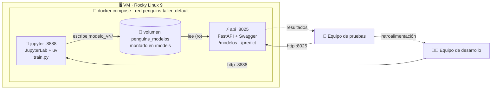

# 🐧 Taller de contenedores · entrenamiento y servicio desacoplados

Dos contenedores en la misma VM, orquestados con **Docker Compose**, que comparten un
**volumen de modelos versionados**:

| Contenedor | Quién lo usa | Qué hace | Puerto |
|---|---|---|---|
| `jupyter` | Equipo de desarrollo | JupyterLab (instalado con **uv**) para entrenar y publicar versiones | `8888` |
| `api` | Equipo de pruebas / producto | FastAPI que descubre las versiones y las ejecuta | `8025` |

La pregunta central del taller —cómo comparten los modelos y cómo se mantiene el historial—
se resuelve con tres piezas: un **volumen Docker nombrado**, una **convención de carpetas
`modelo_vN`** y un **descubrimiento en caliente** del lado de la API.

---

## Tabla de contenidos

- [Quick start](#quick-start)
- [Arquitectura](#arquitectura)
- [Cómo se comparten los modelos](#cómo-se-comparten-los-modelos)
- [Versionado](#versionado)
- [Flujo de trabajo](#flujo-de-trabajo)
- [API de inferencia](#api-de-inferencia)
- [uv dentro del Compose](#uv-dentro-del-compose)
- [Despliegue en la VM](#despliegue-en-la-vm)
- [Operación](#operación)
- [Estructura del proyecto](#estructura-del-proyecto)
- [Decisiones de diseño](#decisiones-de-diseño)

---

## Quick start

```bash
cp .env.example .env          # definir JUPYTER_TOKEN
docker compose up -d --build

# 1. Entrenar la primera versión (equipo de desarrollo)
docker compose exec jupyter python scripts/train.py --notas "baseline"

# 2. Verla desde la API (equipo de pruebas), sin reiniciar nada
curl -s http://localhost:8025/modelos | python3 -m json.tool
```

| Servicio | URL |
|---|---|
| JupyterLab | <http://localhost:8888> (token = `JUPYTER_TOKEN`) |
| Swagger (interfaz del equipo de pruebas) | <http://localhost:8025/docs> |

La API no trae frontend propio: se opera desde Swagger, que es donde el equipo de pruebas
elige la versión a ejecutar.

---

## Arquitectura



Los dos servicios se construyen desde **un único `Dockerfile`** con dos targets
(`jupyter` y `api`) y **el mismo `pyproject.toml`/`uv.lock`**. Eso no es cosmético: garantiza
que la versión de scikit-learn que serializa un `.pkl` sea la misma que lo deserializa. Si cada
imagen resolviera sus dependencias por su cuenta, un día la API dejaría de poder cargar los modelos.

---

## Cómo se comparten los modelos

Un volumen Docker nombrado, montado en los dos contenedores:

```yaml
volumes:
  modelos:
    name: penguins_modelos

services:
  jupyter:
    volumes:
      - modelos:/models        # lectura y escritura: acá se publica
  api:
    volumes:
      - modelos:/models:ro     # sólo lectura: la API consume, no publica
```

Tres consecuencias:

1. **Persiste** aunque los contenedores se borren o reinicien (`docker compose down` no lo toca;
   sólo `down -v` lo elimina).
2. **No depende del filesystem del host**, a diferencia de un bind mount: es un artefacto
   gestionado por Docker, con su propio ciclo de vida.
3. El montaje `:ro` en la API vuelve explícito quién produce y quién consume. Si mañana alguien
   agrega un endpoint que escriba modelos, falla en el acto.

---

## Versionado

### Layout en el volumen

```
/models/
├── modelo_v1/
│   ├── metadata.json          <- marca de "versión completa"
│   ├── randomforest.pkl
│   ├── decisiontree.pkl
│   └── logisticregression.pkl
├── modelo_v2/
│   ├── metadata.json
│   └── randomforest.pkl
└── modelo_v3/
```

Cada carpeta es una corrida de entrenamiento y puede contener uno o varios algoritmos.
`metadata.json` guarda la trazabilidad:

```json
{
  "version": "modelo_v2",
  "numero": 2,
  "creado": "2026-09-05T15:49:48+00:00",
  "autor": "equipo-desarrollo",
  "notas": "random forest con 400 árboles",
  "dataset": { "filas": 333, "train": 266, "test": 67, "clases": ["Adelie", "Chinstrap", "Gentoo"] },
  "entorno": { "python": "3.12.12", "scikit_learn": "1.9.0", "pandas": "3.0.5" },
  "modelos": {
    "randomforest": { "archivo": "randomforest.pkl", "accuracy": 0.9851, "f1_macro": 0.9827 }
  }
}
```

### Cómo se evita sobrescribir

El código vive en `src/penguins_ml/registry.py`, compartido por los dos contenedores.

| Riesgo | Solución |
|---|---|
| Dos entrenamientos simultáneos piden el mismo número | El número se reserva con `mkdir`, que es **atómico**: el segundo recibe `FileExistsError` y reintenta con `N+1` |
| La API lee una versión a medio escribir | `metadata.json` se escribe **al final**, con `write` + `os.replace`. La API sólo lista carpetas que ya lo tienen |
| Un entrenamiento se corta a la mitad | Deja una carpeta sin `metadata.json`: invisible para la API. El número queda quemado, que es lo correcto — no se reciclan versiones |
| La API sirve un `.pkl` viejo desde la caché | La caché se invalida por `mtime` del archivo, con un tope de 8 modelos en memoria |

### Cómo la API detecta versiones nuevas

No carga nada en el arranque. En cada request lista `/models` y carga bajo demanda. Por eso
**no hay que reiniciar la API cuando aparece un modelo nuevo**: aparece en `GET /modelos` en
cuanto el entrenamiento termina de escribir su `metadata.json`.

---

## Flujo de trabajo

```
1. Desarrollo      Jupyter → train_and_register() → estimadores + métricas
2. Almacenamiento  registry.save_version() → /models/modelo_vN/ (volumen)
3. Disponibilidad  GET /modelos → la API lista el historial completo
4. Prueba          El equipo elige versión y algoritmo → POST /predict → resultado
5. Retroalimentación  Hallazgos → nueva corrida → modelo_vN+1
```

Desde el notebook `notebooks/01_entrenamiento.ipynb`:

```python
from penguins_ml import training

meta = training.train_and_register(notas="baseline con los tres algoritmos")

meta = training.train_and_register(
    ["randomforest"],
    notas="400 árboles, profundidad 6",
    params={"randomforest": {"n_estimators": 400, "max_depth": 6}},
)
```

O por línea de comandos:

```bash
docker compose exec jupyter python scripts/train.py --notas "baseline"
docker compose exec jupyter python scripts/train.py --algoritmos randomforest --notas "prueba"
```

---

## API de inferencia

Sin interfaz propia. El equipo de pruebas trabaja desde **Swagger** en `/docs`; `/` redirige ahí.

| Ruta | Método | Descripción |
|---|---|---|
| `/modelos` | GET | Historial de versiones, de la más nueva a la más vieja |
| `/modelos/{version}` | GET | `metadata.json` completo: métricas, dataset y entorno |
| `/predict` | POST | Ejecuta la versión y el algoritmo seleccionados |
| `/health` | GET | Estado del servicio y del volumen |
| `/modelos/refresh` | POST | Vacía la caché de modelos en memoria |
| `/docs` · `/redoc` · `/openapi.json` | GET | Documentación interactiva y esquema |

### El desplegable de versiones

Esta es la pieza que responde al requisito: **el equipo de pruebas elige entre las versiones
que existan en ese momento**, y la lista crece sola.

En `POST /predict`, `version` y `modelo` son **parámetros de query**, no campos del body. Es a
propósito: Swagger UI edita el body como JSON crudo y ahí no dibuja ningún selector, mientras
que un parámetro con `enum` se renderiza como un `<select>`.

Y el `enum` se calcula leyendo el volumen. `app.openapi` está sobreescrito para regenerar el
esquema en **cada** llamada a `/openapi.json`, sin cachearlo:

```python
def openapi_dinamico() -> dict[str, Any]:
    esquema = get_openapi(title=app.title, version=app.version, ..., routes=app.routes)
    nombres = [v["version"] for v in registry.list_versions()]
    for parametro in ...:                       # los que se llaman `version`
        parametro["schema"]["enum"] = ["latest"] + nombres
    return esquema

app.openapi = openapi_dinamico
```

El efecto es el pedido:

| Momento | Desplegable en Swagger |
|---|---|
| Volumen vacío | (sin opciones; la descripción explica cómo entrenar la primera) |
| Desarrollo publica `modelo_v1` | `latest`, `modelo_v1` |
| Publica `modelo_v2` | `latest`, `modelo_v2`, `modelo_v1` |
| Publica `modelo_v3` | `latest`, `modelo_v2`, `modelo_v3`, `modelo_v1` |

Basta con **refrescar `/docs` (F5)**. La API no se reinicia y el contenedor no se toca. La
cabecera de la página además lista las versiones presentes y qué algoritmos trae cada una.

El desplegable `modelo` ofrece los algoritmos existentes en el conjunto de versiones, más
`auto`. Si se pide uno que esa versión no tiene, la respuesta es un `400` que enumera los válidos.

### `POST /predict`

```bash
curl -X POST "http://localhost:8025/predict?version=modelo_v1&modelo=randomforest" \
  -H "Content-Type: application/json" \
  -d '{"bill_length_mm":39.1,"bill_depth_mm":18.7,"flipper_length_mm":181,
       "body_mass_g":3750,"island":"Torgersen","sex":"MALE"}'
```

```json
{
  "version": "modelo_v1",
  "modelo": "randomforest",
  "species": "Adelie",
  "probabilities": { "Adelie": 0.995, "Chinstrap": 0.005, "Gentoo": 0.0 },
  "entrenado": "2026-09-05T17:19:13+00:00"
}
```

La respuesta siempre dice **qué versión y qué algoritmo** se ejecutaron, incluso con
`version=latest`. Sin eso, un resultado de prueba no es trazable.

| Código | Cuándo |
|---|---|
| `404` | La versión no existe, o el volumen todavía está vacío |
| `400` | Ese algoritmo no está en esa versión (el detalle lista los que sí) |
| `422` | Medidas fuera de rango o nombre de versión mal formado |

## uv dentro del Compose

`uv` sólo aparece en las etapas de build: resuelve el entorno con `uv sync` y las imágenes
finales se quedan con el `.venv`, sin uv ni toolchain, sobre `python:3.12-slim`.

```dockerfile
FROM ghcr.io/astral-sh/uv:python3.12-bookworm-slim AS uv-base
COPY pyproject.toml uv.lock* ./

FROM uv-base AS deps-api
RUN uv sync --no-install-project --no-dev                    # sin jupyterlab

FROM uv-base AS deps-jupyter
RUN uv sync --no-install-project --no-dev --group jupyter    # con jupyterlab
```

JupyterLab está en un **dependency group** (PEP 735), no en las dependencias base: el contenedor
de desarrollo lo instala, la imagen de la API no lo arrastra.

En el contenedor `jupyter` sí queda el binario de `uv` para agregar dependencias durante el
desarrollo, apuntando al mismo entorno:

```bash
docker compose exec jupyter uv add xgboost   # actualiza pyproject.toml + uv.lock
docker compose up -d --build                 # las imágenes se rehacen con la dependencia nueva
```

> Para builds reproducibles conviene correr `uv lock` en el host y commitear `uv.lock`.
> Si el lockfile está presente, el build lo respeta; si no, uv resuelve durante el build.

---

## Despliegue en la VM

```bash
ssh estudiante@10.43.97.100

# Docker (Rocky Linux 9)
sudo dnf -y install dnf-plugins-core
sudo dnf config-manager --add-repo https://download.docker.com/linux/centos/docker-ce.repo
sudo dnf -y install docker-ce docker-ce-cli containerd.io docker-compose-plugin
sudo systemctl enable --now docker
sudo usermod -aG docker $USER && newgrp docker

# Proyecto
git clone <repo> && cd penguins
cp .env.example .env
docker compose up -d --build

# Firewall
sudo firewall-cmd --permanent --add-port=8025/tcp
sudo firewall-cmd --permanent --add-port=8888/tcp
sudo firewall-cmd --reload
```

**Checklist de validación**

- [ ] `docker compose ps` muestra los dos servicios en `running`
- [ ] `curl http://localhost:8025/health` responde `{"status":"ok"}`
- [ ] `curl http://10.43.97.100:8025/health` responde desde otra máquina (VPN + firewall)
- [ ] JupyterLab abre en `http://10.43.97.100:8888` con el token
- [ ] Después de entrenar, `GET /modelos` muestra la versión nueva sin reiniciar la API

**Notas de Rocky Linux**

- SELinux viene en `enforcing`. Los bind mounts del Compose llevan `:z` para que Docker les
  ponga la etiqueta correcta. El volumen nombrado no necesita nada.
- Los contenedores corren como UID 1000, igual que el usuario `estudiante`, así que los
  archivos del bind mount de `notebooks/` quedan con el dueño correcto.
- Nunca commitear `.env`, tokens ni credenciales de la VPN.

---

## Operación

```bash
docker compose ps                  # estado
docker compose logs -f api         # logs
docker compose restart api         # reiniciar sólo la API

docker volume inspect penguins_modelos                    # dónde vive el volumen
docker compose exec api ls -la /models                    # qué versiones hay
docker run --rm -v penguins_modelos:/m -v $PWD:/backup alpine \
  tar czf /backup/modelos-$(date +%F).tar.gz -C /m .      # backup

docker compose down                # baja todo, el volumen se conserva
docker compose down -v             # ⚠️ borra el volumen y TODAS las versiones
```

También hay un `Makefile`: `make up`, `make train NOTAS="..."`, `make versions`, `make clean`.

---

## Trabajar desde VS Code

### Opción A · contra la VM con Remote-SSH (lo que se evalúa)

En `C:\Users\<usuario>\.ssh\config`:

```
Host taller
    HostName 10.43.97.100
    User estudiante
```

Después: `Ctrl+Shift+P` → **Remote-SSH: Connect to Host** → `taller` → abrir la carpeta del
proyecto. Todo lo que se corra en la terminal integrada se ejecuta en la VM.

```bash
docker compose up -d --build
docker compose exec jupyter python scripts/train.py --notas "baseline"
```

VS Code detecta los puertos que escuchan en la VM y los reenvía al PC. En el panel **PORTS**
tienen que aparecer `8025` y `8888`; si no, agregarlos con *Forward a Port*. A partir de ahí,
`http://localhost:8025` en el navegador de Windows apunta a la VM sin tocar el firewall.

### Opción B · local con Docker Desktop

Mismo `docker compose up -d --build` en Windows. Los `:z` de SELinux se ignoran ahí, no molestan.
Sirve para iterar rápido antes de subir a la VM.

### Probar la API

Lo normal es Swagger en <http://localhost:8025/docs>. Para repetir siempre el mismo juego de
pruebas sin clickear, `tests/api.http` con la extensión **REST Client**: cada bloque tiene un
botón *Send Request* y la respuesta abre al lado. Incluye los casos de error esperados.

### Correr el notebook contra el contenedor

`Ctrl+Shift+P` → **Notebook: Select Kernel** → *Existing Jupyter Server* → `http://localhost:8888`
→ pegar el `JUPYTER_TOKEN`. El notebook corre con el kernel del contenedor, con `penguins_ml` y el
volumen ya montados.

Alternativa: extensión **Dev Containers** → *Attach to Running Container* → `penguins-jupyter`.
Se abre una ventana de VS Code adentro del contenedor; el intérprete es `/app/.venv/bin/python`.

> Swagger carga sus assets desde un CDN. Si `/docs` sale en blanco, el navegador no tiene
> salida a internet; `GET /openapi.json` y `tests/api.http` siguen funcionando igual.

### Ver el volumen sin salir del editor

Con la extensión **Docker**: los dos contenedores en *Containers* (logs, terminal, restart) y
`penguins_modelos` en *Volumes*. Para ver el contenido:

```bash
docker compose exec api ls -la /models
docker compose exec api cat /models/modelo_v1/metadata.json
```

### Detalles de editar desde Windows

- `.vscode/settings.json` fuerza `files.eol: "\n"`. Un archivo con CRLF que entra al contenedor
  puede romper cosas; el `Makefile` además necesita tabs reales.
- `python.analysis.extraPaths: ["./src"]` es lo que hace que Pylance resuelva `penguins_ml`
  cuando editás desde el host, fuera del contenedor.

---

## Estructura del proyecto

```
.
├── docker-compose.yml            # los dos servicios + el volumen compartido
├── Dockerfile                    # multi-stage, targets `api` y `jupyter`
├── pyproject.toml                # dependencias comunes + grupo `jupyter`
├── .env.example
├── Makefile
├── api/app.py                    # FastAPI: descubre versiones y arma el desplegable
├── src/penguins_ml/
│   ├── registry.py               # versionado: reservar, publicar, listar, cargar
│   └── training.py               # entrenamiento y métricas
├── scripts/train.py              # CLI de entrenamiento
├── notebooks/01_entrenamiento.ipynb
├── tests/api.http                # pruebas con REST Client
├── .vscode/                      # extensiones recomendadas + settings
└── data/penguins.csv
```

`src/` se copia en las dos imágenes: es el contrato compartido sobre el layout del volumen.
Si cambia el formato de `metadata.json`, cambia en un solo lugar.

---

## Decisiones de diseño

| Decisión | Por qué |
|---|---|
| Volumen nombrado en vez de bind mount | Portable entre hosts, gestionado por Docker, sin depender de rutas ni permisos del sistema de archivos anfitrión |
| `metadata.json` como marca de commit | Hace atómica la publicación de una versión sin necesidad de locks ni de una base de datos |
| Descubrimiento por request, no en el `lifespan` | Un modelo nuevo aparece sin reiniciar la API, que es justo lo que pide el enunciado |
| Caché invalidada por `mtime`, tope de 8 | Evita releer del disco en cada predicción sin que la memoria crezca con el historial |
| Un Dockerfile y un lockfile para las dos imágenes | Misma versión de scikit-learn a ambos lados del `.pkl` |
| `:ro` en el montaje de la API | El rol de cada contenedor queda escrito en la infraestructura, no sólo en la documentación |
| `version` y `modelo` como query params | Es la única forma de que Swagger los muestre como desplegables; los campos del body se editan como JSON crudo |
| OpenAPI regenerado sin caché | El desplegable refleja el volumen real en cada F5, sin reiniciar la API |
| Varios algoritmos por versión | Una corrida de entrenamiento es una unidad comparable; el equipo de pruebas compara algoritmos dentro de la misma versión y versiones entre sí |

### Qué falta para producción

Autenticación en la API, HTTPS con reverse proxy, CI/CD que construya y publique imágenes,
métricas y trazas, y un registro de modelos formal (MLflow) si el historial crece más allá de
lo que una carpeta puede ordenar.
