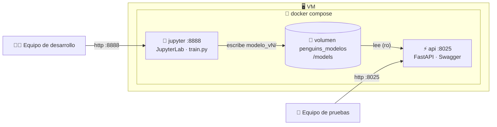

# 🐧 Penguins Classifier

Clasificador de especies de pingüinos (Palmer Archipelago) con **entrenamiento e inferencia desacoplados**: un contenedor de **JupyterLab** entrena y publica versiones de modelos, y un contenedor de **FastAPI** las descubre y las sirve. Ambos corren en la misma VM con **Docker Compose** y comparten un **volumen de modelos versionados**.

> Repositorio: <https://github.com/aristotekean/penguins>

---

## Tabla de contenidos

- [Quick start](#quick-start)
- [Arquitectura](#arquitectura)
- [Flujo de datos y entrenamiento](#flujo-de-datos-y-entrenamiento)
- [Modelos y versionado](#modelos-y-versionado)
- [API de inferencia](#api-de-inferencia)
- [Entorno local con uv](#entorno-local-con-uv)
- [Docker Compose](#docker-compose)
- [Despliegue en VM](#despliegue-en-vm)
- [VPN y red](#vpn-y-red)
- [Control de versiones](#control-de-versiones)
- [Trazabilidad y reproducibilidad](#trazabilidad-y-reproducibilidad)
- [Estructura del proyecto](#estructura-del-proyecto)
- [Síntesis técnica](#síntesis-técnica)

---

## Quick start

```bash
# 1. Levantar los dos servicios
docker compose up -d --build

# 2. Entrenar la primera versión
docker compose exec jupyter python scripts/train.py --notas "baseline"

# 3. Probar (la API ya la ve, sin reiniciar nada)
curl -X POST "http://localhost:8025/predict?version=latest&modelo=randomforest" \
  -H "Content-Type: application/json" \
  -d '{"bill_length_mm":39.1,"bill_depth_mm":18.7,"flipper_length_mm":181,"body_mass_g":3750,"island":"Torgersen","sex":"MALE"}'
```

| Servicio | URL |
|----------|-----|
| API + Swagger | <http://localhost:8025/docs> |
| JupyterLab | <http://localhost:8888> (token por defecto: `taller`) |

---

## Arquitectura

La arquitectura separa tres dominios: **entrenamiento**, **servicio** y **consumo**.



| Capa | Responsabilidad | Artefactos |
|------|-----------------|------------|
| `jupyter` | Entrenar, evaluar y publicar versiones en el volumen | `notebooks/`, `scripts/train.py`, `src/penguins_ml/` |
| Volumen | Persistir el historial de modelos entre reinicios | `penguins_modelos` montado en `/models` |
| `api` | Descubrir versiones y exponer `POST /predict` | `api/app.py`, `src/penguins_ml/registry.py` |

Los dos servicios se construyen desde **un único `Dockerfile`** (targets `api` y `jupyter`) y **el mismo `uv.lock`**. Eso garantiza que la versión de scikit-learn que serializa un `.pkl` sea la misma que lo deserializa.

---

## Flujo de datos y entrenamiento

`train_and_register()` procesa `data/penguins.csv`, entrena y publica una versión nueva.

| Paso | Detalle |
|------|---------|
| Limpieza | Se eliminan filas con datos incompletos |
| Features numéricas | `bill_length_mm`, `bill_depth_mm`, `flipper_length_mm`, `body_mass_g` |
| Features categóricas | `island`, `sex` → `OneHotEncoder` |
| Target | `species` |
| Split | 80/20 estratificado |
| Evaluación | `accuracy` + `f1_macro`, guardados en `metadata.json` |

Desde el notebook `notebooks/01_entrenamiento.ipynb`:

```python
from penguins_ml import training

training.train_and_register(notas="baseline con los tres algoritmos")

training.train_and_register(
    ["randomforest"],
    notas="400 árboles, profundidad 6",
    params={"randomforest": {"n_estimators": 400, "max_depth": 6}},
)
```

O por línea de comandos:

```bash
docker compose exec jupyter python scripts/train.py --notas "baseline"
docker compose exec jupyter python scripts/train.py --algoritmos randomforest --notas "prueba"
```

---

## Modelos y versionado

Cada entrenamiento es una carpeta `modelo_vN` en el volumen, con uno o varios algoritmos.

| Algoritmo | Identificador en la API |
|-----------|-------------------------|
| Random Forest (200 árboles) | `randomforest` |
| Decision Tree | `decisiontree` |
| Logistic Regression | `logisticregression` |

```
/models/
├── modelo_v1/
│   ├── metadata.json          # marca de "versión completa"
│   ├── randomforest.pkl
│   ├── decisiontree.pkl
│   └── logisticregression.pkl
└── modelo_v2/
    ├── metadata.json
    └── randomforest.pkl
```

`metadata.json` guarda la trazabilidad de cada versión: fecha, autor, notas, dataset, versiones de Python y scikit-learn, y métricas por algoritmo.

**Cómo se evita sobrescribir** (`src/penguins_ml/registry.py`)

| Riesgo | Solución |
|--------|----------|
| Dos entrenamientos piden el mismo número | El número se reserva con `mkdir`, que es atómico; el segundo reintenta con `N+1` |
| La API lee una versión a medio escribir | `metadata.json` se escribe al final con `os.replace`; la API sólo lista carpetas que ya lo tienen |
| La API sirve un `.pkl` viejo desde caché | La caché se invalida por `mtime`, con tope de 8 modelos en memoria |

La API **no carga nada al arrancar**: lee el volumen en cada request. Una versión nueva aparece en `GET /modelos` sin reiniciar nada.

> ⚠️ Los `.pkl` sólo se pueden cargar con la **misma versión de scikit-learn** con la que se entrenaron. Si cambiás la dependencia en `pyproject.toml`, reconstruí las dos imágenes y reentrená.

---

## API de inferencia

Sin interfaz propia: el equipo de pruebas trabaja desde **Swagger** en `/docs` (`/` redirige ahí).

| Ruta | Método | Descripción |
|------|--------|-------------|
| `/modelos` | GET | Historial de versiones, de la más nueva a la más vieja |
| `/modelos/{version}` | GET | `metadata.json` completo de una versión |
| `/predict` | POST | Ejecuta la versión y el algoritmo seleccionados |
| `/health` | GET | Estado del servicio y del volumen |
| `/modelos/refresh` | POST | Vacía la caché de modelos en memoria |
| `/docs` · `/redoc` · `/openapi.json` | GET | Documentación interactiva y esquema |

### `POST /predict`

`version` y `modelo` van como **query params** para que Swagger los dibuje como desplegables. El `enum` se regenera leyendo el volumen en cada llamada a `/openapi.json`: publicás `modelo_v3`, refrescás `/docs` y ya aparece.

| Parámetro | Valores |
|-----------|---------|
| `version` | `latest` \| `modelo_v1` \| `modelo_v2` \| … |
| `modelo` | `auto` \| `randomforest` \| `decisiontree` \| `logisticregression` |

**Body**

| Campo | Tipo | Valores |
|-------|------|---------|
| `bill_length_mm` | float > 0 | rango observado 32.1–59.6 |
| `bill_depth_mm` | float > 0 | rango observado 13.1–21.5 |
| `flipper_length_mm` | float > 0 | rango observado 172–231 |
| `body_mass_g` | float > 0 | rango observado 2700–6300 |
| `island` | string | `Torgersen` \| `Biscoe` \| `Dream` |
| `sex` | string | `MALE` \| `FEMALE` |

**Response**

```json
{
  "version": "modelo_v1",
  "modelo": "randomforest",
  "species": "Adelie",
  "probabilities": { "Adelie": 0.995, "Chinstrap": 0.005, "Gentoo": 0.0 },
  "entrenado": "2026-09-05T17:19:13+00:00"
}
```

La respuesta siempre dice qué versión y qué algoritmo se ejecutaron, incluso con `version=latest`.

| Código | Cuándo |
|--------|--------|
| `404` | La versión no existe o el volumen está vacío |
| `400` | Ese algoritmo no está en esa versión |
| `422` | Medidas fuera de rango o versión mal formada |

`tests/api.http` contiene un juego de pruebas listo para la extensión REST Client de VS Code.

---

## Entorno local con uv

El proyecto usa [uv](https://docs.astral.sh/uv/). Requiere **Python >= 3.12**. Las dependencias se declaran en `pyproject.toml` y se fijan en `uv.lock`. JupyterLab está en el dependency group `jupyter`, así la imagen de la API no lo arrastra.

```bash
# Instalar uv
curl -LsSf https://astral.sh/uv/install.sh | sh

# Instalar dependencias (con --group jupyter para el entorno de entrenamiento)
uv sync --group jupyter

# Entrenar en local
PYTHONPATH=src MODELS_DIR=./models DATA_PATH=data/penguins.csv \
  uv run python scripts/train.py --notas "local"

# Correr la API en local
PYTHONPATH=src MODELS_DIR=./models \
  uv run uvicorn api.app:app --host 0.0.0.0 --port 8025 --reload
```

Para agregar una dependencia desde el contenedor de desarrollo:

```bash
docker compose exec jupyter uv add xgboost   # actualiza pyproject.toml
uv lock                                      # en el host, commitear uv.lock
docker compose up -d --build
```

---

## Docker Compose

El `Dockerfile` es multi-stage con dos targets:

1. **Builder** (`uv-base`): resuelve dependencias con `uv sync` desde `uv.lock`.
2. **`api`**: `python:3.12-slim` con el `.venv`, `src/` y `api/`. Puerto `8025`, healthcheck sobre `/health`.
3. **`jupyter`**: `python:3.12-slim` con el `.venv` + JupyterLab y el binario de `uv`. Puerto `8888`.

Ambos montan el volumen `penguins_modelos` en `/models`: lectura/escritura en `jupyter`, **sólo lectura** en `api`.

### Variables de entorno

| Variable | Default | Uso |
|----------|---------|-----|
| `JUPYTER_TOKEN` | `taller` | Token de acceso a JupyterLab |
| `AUTOR` | `equipo-desarrollo` | Se guarda en `metadata.json` |

```bash
JUPYTER_TOKEN=mi-token docker compose up -d --build
```

### Comandos útiles

```bash
docker compose ps                                  # estado
docker compose logs -f api                         # logs
docker compose restart api                         # reiniciar sólo la API
docker compose exec api ls -la /models             # qué versiones hay

docker compose down                                # baja todo, el volumen se conserva
docker compose down -v                             # ⚠️ borra el volumen y TODAS las versiones
```

### Backup del volumen

```bash
docker run --rm -v penguins_modelos:/m -v "$PWD":/backup alpine \
  tar czf /backup/modelos-$(date +%F).tar.gz -C /m .
```

---

## Despliegue en VM

```
Usuario / Integración → VM → Docker Compose → FastAPI → Volumen de modelos
```

**Requisitos de la VM**

- [ ] Docker + plugin de Compose instalados
- [ ] Conectividad de red
- [ ] Puertos `8025` y `8888` accesibles (firewall / security group)

**Flujo de despliegue**

```bash
# En la VM
git clone https://github.com/aristotekean/penguins.git
cd penguins
docker compose up -d --build
```

> En Rocky Linux con SELinux en `enforcing`, los bind mounts del Compose ya llevan `:z`. El volumen nombrado no necesita nada extra.

---

## VPN y red

Cuando la VM pertenece a una red privada, el acceso se realiza mediante la VPN correspondiente.

**Checklist de validación**

- [ ] Conectividad con la VM (`ping` / `ssh`)
- [ ] Puertos `8025` y `8888` abiertos en el firewall
- [ ] `curl http://<vm-ip>:8025/health` responde `{"status":"ok", ...}`
- [ ] JupyterLab abre en `http://<vm-ip>:8888` con el token
- [ ] Después de entrenar, `GET /modelos` muestra la versión nueva sin reiniciar la API

> 🔒 La VPN, tokens y credenciales son elementos de infraestructura y seguridad. **Nunca** deben formar parte del repositorio.

---

## Control de versiones

Git + GitHub como mecanismo de control y trazabilidad.

| Elemento | Valor |
|----------|-------|
| Rama principal | `main` |
| Flujo | `feature/*` → validación → Pull Request → `main` |
| Commits | Pequeños y descriptivos (conventional commits) |

`.gitignore` excluye artefactos del entorno y archivos sensibles (`.venv/`, `__pycache__/`, `.ipynb_checkpoints/`, `.env`).

---

## Trazabilidad y reproducibilidad

| Artefacto | Garantiza |
|-----------|-----------|
| Git / GitHub | Código y versiones |
| `uv.lock` | Dependencias exactas en las dos imágenes |
| `modelo_vN/metadata.json` | Qué se entrenó, con qué datos, con qué entorno y con qué métricas |
| `Dockerfile` | Entorno de ejecución |
| Volumen `penguins_modelos` | Historial completo de modelos |

**Ciclo ante un cambio de modelo**

```
Datos/código → entrenamiento → evaluación → modelo_vN+1 en el volumen → pruebas desde Swagger → retroalimentación
```

---

## Estructura del proyecto

```
penguins/
├── api/app.py                    # FastAPI: descubre versiones y arma los desplegables
├── src/penguins_ml/
│   ├── registry.py               # versionado: reservar, publicar, listar, cargar
│   └── training.py               # entrenamiento y métricas
├── scripts/train.py              # CLI de entrenamiento
├── notebooks/01_entrenamiento.ipynb
├── data/penguins.csv             # Dataset
├── tests/api.http                # Pruebas con REST Client
├── docker-compose.yml            # Dos servicios + volumen compartido
├── Dockerfile                    # Multi-stage, targets `api` y `jupyter`
├── .dockerignore
├── .gitignore
├── pyproject.toml                # Dependencias + grupo `jupyter`
├── uv.lock                       # Lockfile
└── README.md
```

`src/` se copia en las dos imágenes: es el contrato compartido sobre el layout del volumen.

---

## Síntesis técnica

1. Preparación de datos.
2. Entrenamiento y comparación de tres algoritmos por versión.
3. Publicación atómica en un volumen versionado.
4. Descubrimiento en caliente desde la API REST.
5. Selección de versión y algoritmo desde Swagger.
6. Contenerización con Docker Compose.
7. Despliegue en VM.

El diseño separa entrenamiento, almacenamiento e inferencia, y deja una base reproducible para evolucionar hacia un esquema productivo con CI/CD, monitoreo, autenticación, HTTPS, gestión de secretos y un registro formal de modelos (MLflow).
